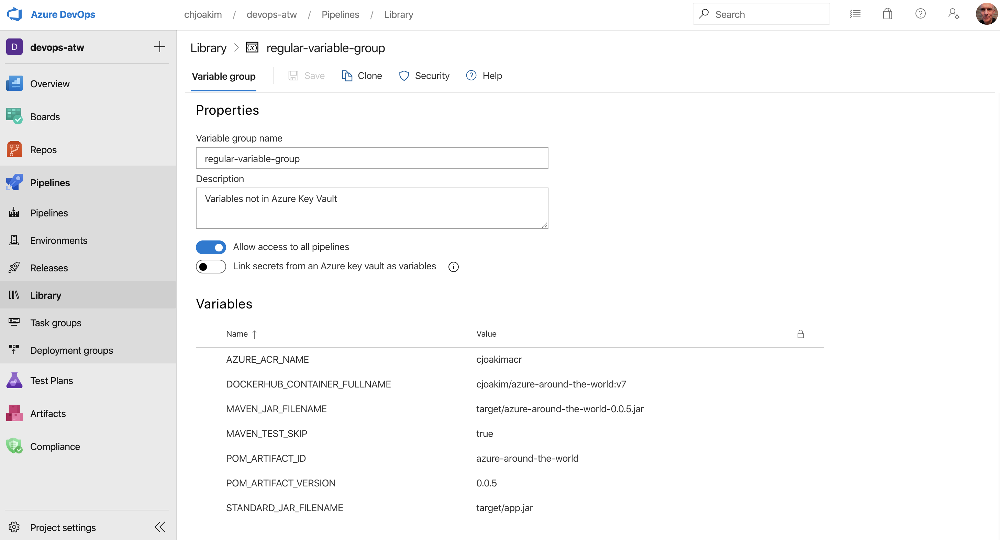

# azure devops pipeline

See file [azure-pipelines.yml](../azure-pipelines.yml) which defines the **Azure DevOps Pipeline**
execution steps.

This example executes a verbose and low-level set of commands on Ubuntu Linux.

Notice how **variable groups** are used to externalize otherwise hard-coded values in the pipeline.
Variables are resolved with this syntax: $(VARIABLE_NAME)

The DevOps Pipeline YAML for this project is shown below:

```
# DevOps Build & Release Pipeline
# Chris Joakim, Microsoft, 2020/04/08

trigger:
- master

pool:
  vmImage: 'Ubuntu 16.04'

variables:
- group: regular-variable-group
- group: keyvault-variable-group

steps:
- script: |
    echo 'regular-variable-group:'
    echo 'POM_ARTIFACT_ID:              '$(POM_ARTIFACT_ID)
    echo 'POM_ARTIFACT_VERSION:         '$(POM_ARTIFACT_VERSION)
    echo 'STANDARD_JAR_FILENAME:        '$(STANDARD_JAR_FILENAME)
    echo 'MAVEN_JAR_FILENAME:           '$(MAVEN_JAR_FILENAME)
    echo 'MAVEN_TEST_SKIP:              '$(MAVEN_TEST_SKIP)
    echo 'DOCKERHUB_CONTAINER_FULLNAME: '$(DOCKERHUB_CONTAINER_FULLNAME)
    echo 'ACR_CONTAINER_FULLNAME:       '$(ACR_CONTAINER_FULLNAME)
    echo 'keyvault-variable-group:'
    echo 'AcrName:                      '$(AcrName)
    echo 'AcrUserName:                  '$(AcrUserName)
    echo 'AcrUserPass:                  '$(AcrUserPass)
    echo 'AcrLoginServer:               '$(AcrLoginServer)
    echo 'NotThere:                     '$(NotThere)
  displayName: 'display the pipeline variables'
  condition: always()

- script: date -u > src/main/resources/build_date.txt
  displayName: 'create build date resource file'

- script: cat src/main/resources/build_date.txt
  displayName: 'cat build date resource file'

- script: whoami  > src/main/resources/build_user.txt
  displayName: 'create build user resource file'

- script: cat src/main/resources/build_user.txt
  displayName: 'cat build user resource file'

- script: mvn dependency:tree
  displayName: 'mvn dependency:tree'

- script: mvn dependency:build-classpath
  displayName: 'mvn dependency:build-classpath'

- script: mvn -f pom.xml -Dmaven.test.skip=true clean package
  displayName: 'mvn clean package'

- script: cp target/azure-around-the-world-0.0.5.jar $STANDARD_JAR_FILENAME
  displayName: 'copy compiled jar file to target/app.jar'

- script: jar tvf target/app.jar
  displayName: 'list jar contents'

- script: docker build -t $DOCKERHUB_CONTAINER_FULLNAME .
  displayName: 'build docker container'

- script: docker build -t $DOCKERHUB_CONTAINER_FULLNAME .
  displayName: 'docker build'

- script: docker tag $DOCKERHUB_CONTAINER_FULLNAME $ACR_CONTAINER_FULLNAME 
  displayName: 'docker tag'

- script: docker images | grep $POM_ARTIFACT_ID
  displayName: 'docker images, after build and tag, grepped for POM_ARTIFACT_ID'

- script: az acr login --name $(AcrName) --username $(AcrUserName) --password $(AcrUserPass)
  displayName: 'login to ACR'

- script: docker push $ACR_CONTAINER_FULLNAME
  displayName: 'docker push to ACR'
  condition: and(succeeded(), eq(variables['Build.SourceBranch'], 'refs/heads/master'))
```

---

## Variable Groups

These groups provide **environment variables** to your Pipeline.

Both "regular" (i.e. - non-encrypted) variables, and "secrets" (i.e. - Azure Key Vault values) 
can be used.  Secrets are typically used for ACR credentials.

The screen shots below show the **regular-variable-group** and the **keyvault-variable-group**.

---

### Regular Variable Group 



---

### Key Vault Variable Group - Select Variables


---

### Key Vault Variable Group


---

## Setting Azure Key Vault Secrets

One way to set these is with the **az CLI** program.
File [akv.sh](../akv.sh) sets these secrets in this repository.

This is the az CLI command to set a KeyVault secret:
```
az keyvault secret set \
    --vault-name $akv_name \
    --name  AcrUserPass \
    --value $AZURE_ACR_USER_PASS
```